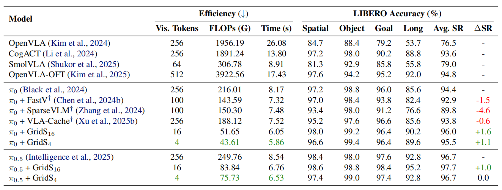
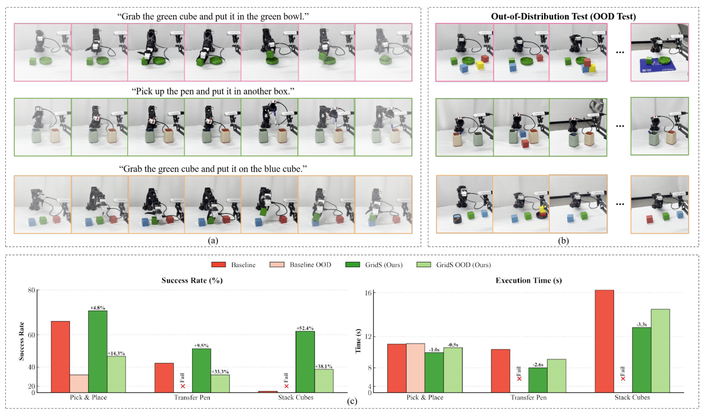
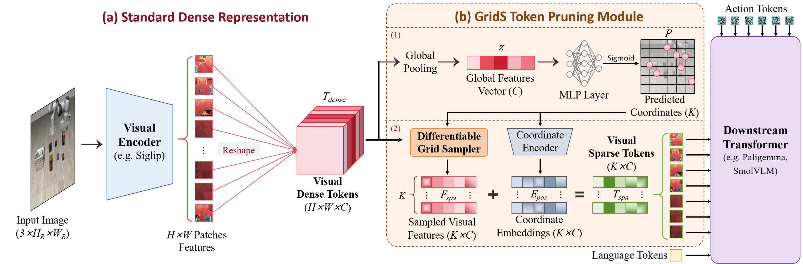

# Grid Sampler [ICML 2026]

#### See What Matters: Differentiable Grid Sample Pruning for Generalizable Vision-Language-Action Model

[Yixu Feng](https://scholar.google.com/citations?user=WljJ2HUAAAAJ), [Zinan Zhao](https://openreview.net/profile?id=~Zinan_Zhao1), [Yanxiang Ma](https://scholar.google.com/citations?user=mBHSbeIAAAAJ), [Chenghao Xia](https://openreview.net/profile?id=~Chenghao_Xia1), [Chengbin Du](https://scholar.google.com/citations?user=guY3iCsAAAAJ), [Yunke Wang](https://scholar.google.com/citations?user=m4wbcOsAAAAJ), [Chang Xu](https://scholar.google.com/citations?user=N4F_3eoAAAAJ)

## Demo 🎞

<table>
<tr>
<td align="center" width="33%"><b>Pen</b><br><video src="demo/GridS_demo_pen.mp4" controls muted playsinline width="100%"></video></td>
<td align="center" width="33%"><b>Pick</b><br><video src="demo/GridS_demo_pick.mp4" controls muted playsinline width="100%"></video></td>
<td align="center" width="33%"><b>Stack</b><br><video src="demo/GridS_demo_stack.mp4" controls muted playsinline width="100%"></video></td>
</tr>
<tr>
<td align="center" width="33%"><b>Pen (OOD)</b><br><video src="demo/GridS_demo_pen_ood.mp4" controls muted playsinline width="100%"></video></td>
<td align="center" width="33%"><b>Pick (OOD)</b><br><video src="demo/GridS_demo_pick_ood.mp4" controls muted playsinline width="100%"></video></td>
<td align="center" width="33%"><b>Stack (OOD)</b><br><video src="demo/GridS_demo_stack_ood.mp4" controls muted playsinline width="100%"></video></td>
</tr>
</table>


## News 🆕

- **2026.05.10** Code public on openpi. 💎
- **2026.05.01** Congratulations! Our paper "See What Matters: Differentiable Grid Sample Pruning for Generalizable Vision-Language-Action Model" has been accepted by ICML 2026. We look forward to subsequent work based on the Grid Sampler! 🔥


## To-Do List ✅
- ✅ Release openpi code with Grid Sampler.
- ⬜ Release X-VLA code with Grid Sampler on Robotwin.
- ⬜ Release Lerobot code with Grid Sampler on real-world dataset.


## Results 📊

<details>
<summary><b>LIBERO:</b></summary>



</details>

<details>
<summary><b>Real-world:</b></summary>



</details>

## 1. Core idea 🌑



*Overview of the GridS Token Pruning framework.*

**(a) Standard Dense Representation:** An input image (*H*<sub>R</sub> and *W*<sub>R</sub> denote the original image resolution) is processed by a visual encoder with ViT-style embeddings (Dosovitskiy et al., 2020) to generate dense visual tokens (*H* × *W* × *C*), capturing full spatial details.

**(b) GridS Token Pruning Module:** This module identifies salient regions to sample a sparse set of visual tokens (*K* × *C*), which includes two stages: (1) Global Coordinate Prediction, and (2) Grid Sampling with Geometry Injection. By ensuring the token count is significantly smaller than the dense spatial resolution (*K* ≪ *H* × *W*), it achieves efficient representation for the downstream Transformer.

## 2. Testing 🌒

### openpi

All runnable checks for this stack live in **openpi**. After environment setup in [`openpi/README.md`](openpi/README.md) (**Installation**), use the main doc as the index:

- **Quick policy smoke test (no robot):** the **“Test inference without a robot”** paragraph under **Running Inference for a Pre-Trained Model** — it points to [`openpi/examples/simple_client/README.md`](openpi/examples/simple_client/README.md).
- **Notebook / general inference flow:** same **Running Inference for a Pre-Trained Model** section (and the linked `examples/inference.ipynb` mentioned there).
- **LIBERO simulation rollout / eval:** [`openpi/examples/libero/README.md`](openpi/examples/libero/README.md) (see also the LIBERO pointer in the fine-tuned checkpoint table on the main README).
- **ALOHA:** simulator workflow in [`openpi/examples/aloha_sim/README.md`](openpi/examples/aloha_sim/README.md); real-robot setup in [`openpi/examples/aloha_real/README.md`](openpi/examples/aloha_real/README.md) (also summarized under **More Examples** in [`openpi/README.md`](openpi/README.md)).

## 3. Finetuning 🌓

### openpi

Fine-tuning follows the **openpi** workflow; the authoritative walkthrough is **[Fine-Tuning Base Models on Your Own Data](openpi/README.md#fine-tuning-base-models-on-your-own-data)** in [`openpi/README.md`](openpi/README.md). In short:

1. **Data:** convert to a LeRobot dataset (LIBERO example: [`openpi/examples/libero/convert_libero_data_to_lerobot.py`](openpi/examples/libero/convert_libero_data_to_lerobot.py)); for LIBERO-only runs you can often skip conversion if you use the bundled dataset as in the upstream configs.
2. **Configs:** data transforms and `TrainConfig` live in [`openpi/src/openpi/training/config.py`](openpi/src/openpi/training/config.py) (e.g. LIBERO policies in [`openpi/src/openpi/policies/libero_policy.py`](openpi/src/openpi/policies/libero_policy.py)). For **Grid Sampler** runs, choose a training config whose model sets `grid=True` (e.g. names like `pi0_libero_grid*`, `pi05_libero_grid*` in that file).
3. **Train (JAX):** compute norm stats then launch training as documented there, e.g. `uv run scripts/compute_norm_stats.py --config-name <your_config>` then `uv run scripts/train.py <your_config> --exp-name=...` (see the same README section for flags and `XLA_PYTHON_CLIENT_MEM_FRACTION`).
4. **PyTorch path:** if you use the PyTorch stack, follow **[PyTorch Support](openpi/README.md#pytorch-support)** in the same README (setup, `train_pytorch.py`, and JAX→PyTorch conversion notes).

Serving a fine-tuned checkpoint is covered under **Spinning up a policy server and running inference** in that chapter, and in [`openpi/scripts/serve_policy.py`](openpi/scripts/serve_policy.py) / [`openpi/examples/libero/README.md`](openpi/examples/libero/README.md) for LIBERO.


## 4. Contacts 🌔
If you have any questions, please contact us or submit an issue to the repository! We sincerely welcome your feedback and contributions.

Yixu Feng ([yfen0429@sydney.edu.au](yfen0429@sydney.edu.au) or [fedioryf@gamil.com](fedioryf@gamil.com))

Zinan Zhao ([zhao48zinan@gamil.com](zhao48zinan@gamil.com))

You can also scan the QR code below to contact me:


## 5. Citation 🌕
If you find our work useful for your research, please cite our paper:

```
@inproceedings{feng2026gridsampler,
  title     = {See What Matters: Differentiable Grid Sample Pruning for Generalizable Vision-Language-Action Model},
  author    = {Feng, Yixu and Zhao, Zinan and Ma, Yanxiang and Xia, Chenghao and Du, Chengbin and Wang, Yunke and Xu, Chang},
  booktitle = {Forty-Third International Conference on Machine Learning (ICML)},
  year      = {2026}
}
  ```