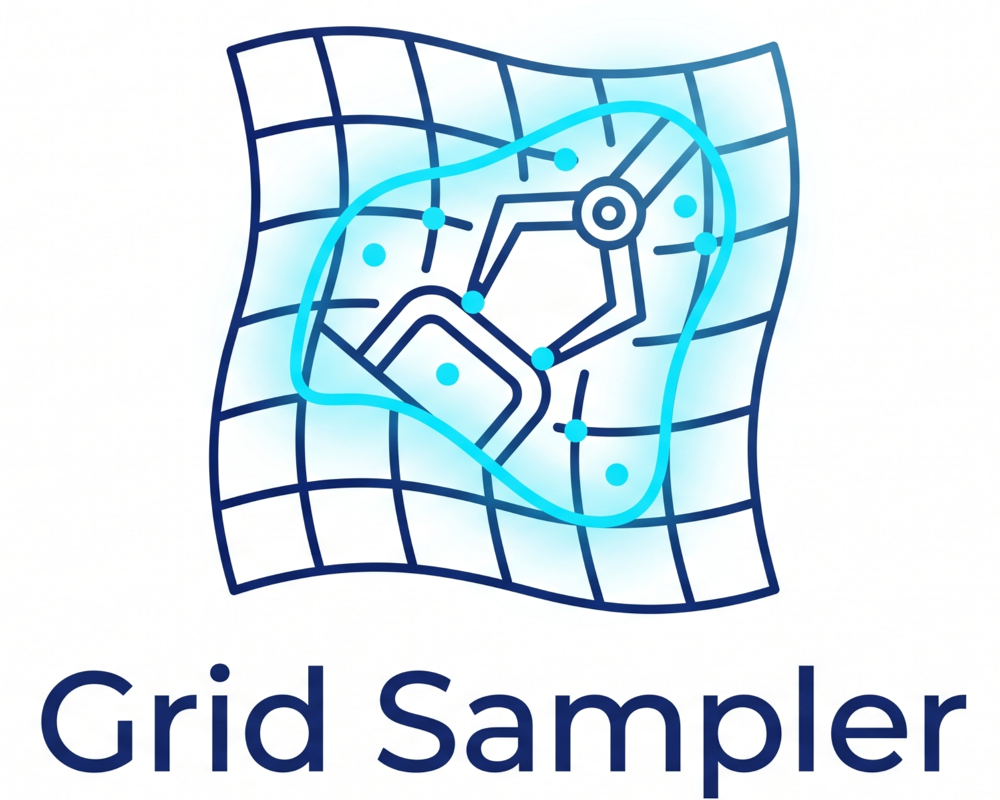

<p align="center">
  
</p>

# Grid Sampler [ICML 2026]

<p align="center">
  <a href="https://github.com/Fediory/Grid-Sampler/tree/main/core_idea"></a>
  &nbsp;
  <a href="https://arxiv.org/abs/2605.11817"></a>
  &nbsp;
  <a href="https://fediory.github.io/Grid-Sampler"></a>
  &nbsp;
  <a href="https://huggingface.co/collections/Fediory/grid-sampler"></a>
</p>

[简体中文](README-ZH.md)

#### See What Matters: Differentiable Grid Sample Pruning for Generalizable Vision-Language-Action Model

<p align="center">
  <a href="https://scholar.google.com/citations?user=WljJ2HUAAAAJ">Yixu Feng</a><sup>1</sup>,
  <a href="https://openreview.net/profile?id=~Zinan_Zhao1">Zinan Zhao</a><sup>2</sup>,
  <a href="https://scholar.google.com/citations?user=mBHSbeIAAAAJ">Yanxiang Ma</a><sup>1</sup>,
  <a href="https://openreview.net/profile?id=~Chenghao_Xia1">Chenghao Xia</a><sup>3</sup>,
  <a href="https://scholar.google.com/citations?user=guY3iCsAAAAJ">Chengbin Du</a><sup>3</sup>,
  <a href="https://scholar.google.com/citations?user=m4wbcOsAAAAJ">Yunke Wang</a><sup>1</sup>,
  <a href="https://scholar.google.com/citations?user=N4F_3eoAAAAJ">Chang Xu</a><sup>1</sup>
</p>
<p align="center">
  <sup>1</sup> University of Sydney &nbsp;·&nbsp;
  <sup>2</sup> City University of Hong Kong &nbsp;·&nbsp;
  <sup>3</sup> StellarEdge Robotics
</p>

## Demo 🎞


**In-domain**

| Pen | Pick | Stack |
|:---:|:---:|:---:|
| [▶ Watch `GridS_demo_pen.mp4`](demo/GridS_demo_pen.mp4) | [▶ Watch `GridS_demo_pick.mp4`](demo/GridS_demo_pick.mp4) | [▶ Watch `GridS_demo_stack.mp4`](demo/GridS_demo_stack.mp4) |

**OOD**

| Pen (OOD) | Pick (OOD) | Stack (OOD) |
|:---:|:---:|:---:|
| [▶ Watch `GridS_demo_pen_ood.mp4`](demo/GridS_demo_pen_ood.mp4) | [▶ Watch `GridS_demo_pick_ood.mp4`](demo/GridS_demo_pick_ood.mp4) | [▶ Watch `GridS_demo_stack_ood.mp4`](demo/GridS_demo_stack_ood.mp4) |


## News 🆕

- **2026.05.10** Code public on openpi. 💎
- **2026.05.01** Congratulations! Our paper "See What Matters: Differentiable Grid Sample Pruning for Generalizable Vision-Language-Action Model" has been accepted by ICML 2026. We look forward to subsequent work based on the Grid Sampler! 🔥


## To-Do List ✅
- ✅ Release openpi code with Grid Sampler.
- ✅ Release Lerobot code with Grid Sampler on real-world dataset.
- ⬜ Release X-VLA code with Grid Sampler on Robotwin.


## Results 📊

<details>
<summary><b>LIBERO:</b></summary>


</details>

<details>
<summary><b>Real-world:</b></summary>


</details>

<a id="core-idea"></a>

## 1. Core idea 🌑


*Overview of the GridS Token Pruning framework.*

**(a) Standard Dense Representation:** An input image (*H*<sub>R</sub> and *W*<sub>R</sub> denote the original image resolution) is processed by a visual encoder with ViT-style embeddings (Dosovitskiy et al., 2020) to generate dense visual tokens (*H* × *W* × *C*), capturing full spatial details.

**(b) GridS Token Pruning Module:** This module identifies salient regions to sample a sparse set of visual tokens (*K* × *C*), which includes two stages: (1) Global Coordinate Prediction, and (2) Grid Sampling with Geometry Injection. By ensuring the token count is significantly smaller than the dense spatial resolution (*K* ≪ *H* × *W*), it achieves efficient representation for the downstream Transformer.

## 2. Testing 🌒

### openpi

All runnable checks for this stack live in **openpi**. After environment setup in [`openpi/README.md`](openpi/README.md) (**Installation**), use the main doc as the index:

- **Quick policy smoke test (no robot):** the **“Test inference without a robot”** paragraph under **Running Inference for a Pre-Trained Model** — it points to [`openpi/examples/simple_client/README.md`](openpi/examples/simple_client/README.md).
- **Notebook / general inference flow:** same **Running Inference for a Pre-Trained Model** section (and the linked `examples/inference.ipynb` mentioned there).
- **LIBERO simulation rollout / eval:** [`openpi/examples/libero/README.md`](openpi/examples/libero/README.md) (see also the LIBERO pointer in the fine-tuned checkpoint table on the main README).
- **ALOHA:** simulator workflow in [`openpi/examples/aloha_sim/README.md`](openpi/examples/aloha_sim/README.md); real-robot setup in [`openpi/examples/aloha_real/README.md`](openpi/examples/aloha_real/README.md) (also summarized under **More Examples** in [`openpi/README.md`](openpi/README.md)).

### LeRobot (PyTorch)

This repo vendors a **LeRobot** fork under [`lerobot/`](lerobot/). Install and CLI usage follow upstream **[`lerobot/README.md`](lerobot/README.md)** (e.g. `pip install -e ".[...]"` from that directory, then `lerobot-train` / `lerobot-eval` as documented there).

**What Grid Sampler changes inside this LeRobot tree**

| Area | Change |
|------|--------|
| **New module** | [`lerobot/src/lerobot/policies/active_token_sampler.py`](lerobot/src/lerobot/policies/active_token_sampler.py) — PyTorch **ActiveTokenSampler**: global-pooled visual context predicts `K` normalized 2D locations, **`F.grid_sample`** bilinearly reads features, optional **coordinate MLP** adds geometry to sampled tokens (non-square feature maps are squared with adaptive pooling first). |
| **SmolVLA** | [`configuration_smolvla.py`](lerobot/src/lerobot/policies/smolvla/configuration_smolvla.py), [`modeling_smolvla.py`](lerobot/src/lerobot/policies/smolvla/modeling_smolvla.py) — flags **`use_grid_token_sampler`** (default `True`) and **`grid_token_sampler_num_tokens`** (default `16`). When on, SigLIP patch tokens are reshaped to a feature map, pruned by `ActiveTokenSampler`, then fed to the VLM as **K tokens** instead of the full patch grid. `forward` / `predict_action_chunk` / `select_action` accept optional **`use_grid_token_sampler`** to override per call (see module docstring at top of `modeling_smolvla.py`). |
| **ACT / Diffusion / VQ-BeT / TDMPC** | Each policy’s **configuration** adds **`use_vision_grid_token_prune`** and **`vision_grid_token_prune_num_tokens`**; the matching **modeling** file wires **`ActiveTokenSampler`** after the CNN / ResNet vision tower (before the usual flatten + transformer or spatial-softmax path), with learnable pos-embeddings sized to `K` when pruning is enabled. |
| **π0 / π0-FAST / SAC / reward classifier** | These files **import** `ActiveTokenSampler` for consistency with the tree, but **do not call it in the forward pass** in this fork — the full **JAX π0 + Grid** path stays in **openpi** (configs with `grid=True`). |

## 3. Finetuning 🌓

### openpi

Fine-tuning follows the **openpi** workflow; the authoritative walkthrough is **[Fine-Tuning Base Models on Your Own Data](openpi/README.md#fine-tuning-base-models-on-your-own-data)** in [`openpi/README.md`](openpi/README.md). In short:

1. **Data:** convert to a LeRobot dataset (LIBERO example: [`openpi/examples/libero/convert_libero_data_to_lerobot.py`](openpi/examples/libero/convert_libero_data_to_lerobot.py)); for LIBERO-only runs you can often skip conversion if you use the bundled dataset as in the upstream configs.
2. **Configs:** data transforms and `TrainConfig` live in [`openpi/src/openpi/training/config.py`](openpi/src/openpi/training/config.py) (e.g. LIBERO policies in [`openpi/src/openpi/policies/libero_policy.py`](openpi/src/openpi/policies/libero_policy.py)). For **Grid Sampler** runs, choose a training config whose model sets `grid=True` (e.g. names like `pi0_libero_grid*`, `pi05_libero_grid*` in that file).
3. **Train (JAX):** compute norm stats then launch training as documented there, e.g. `uv run scripts/compute_norm_stats.py --config-name <your_config>` then `uv run scripts/train.py <your_config> --exp-name=...` (see the same README section for flags and `XLA_PYTHON_CLIENT_MEM_FRACTION`).
4. **PyTorch path:** if you use the PyTorch stack, follow **[PyTorch Support](openpi/README.md#pytorch-support)** in the same README (setup, `train_pytorch.py`, and JAX→PyTorch conversion notes).

Serving a fine-tuned checkpoint is covered under **Spinning up a policy server and running inference** in that chapter, and in [`openpi/scripts/serve_policy.py`](openpi/scripts/serve_policy.py) / [`openpi/examples/libero/README.md`](openpi/examples/libero/README.md) for LIBERO.

### LeRobot

Use the vendored [`lerobot/`](lerobot/) tree: install extras as in **[`lerobot/README.md`](lerobot/README.md)**, then train with the usual LeRobot CLI, for example:

```bash
cd lerobot
pip install -e ".[smolvla]"   # or another policy extra you need
lerobot-train --policy.type=smolvla --dataset.repo_id=...
```

Enable or tune Grid-style pruning via policy kwargs, e.g. **`--policy.use_grid_token_sampler=true|false`** and **`--policy.grid_token_sampler_num_tokens=N`** for **SmolVLA**; for **ACT / Diffusion / VQ-BeT / TDMPC**, use **`--policy.use_vision_grid_token_prune=true`** and **`--policy.vision_grid_token_prune_num_tokens=N`** (must match how the checkpoint was trained when loading weights). See the **“What Grid Sampler changes”** table under **LeRobot (PyTorch)** in **§2 Testing** above for file-level detail.

## 4. Contacts 🌔
If you have any questions, please contact us or submit an issue to the repository! We sincerely welcome your feedback and contributions.

Yixu Feng ([yfen0429@sydney.edu.au](yfen0429@sydney.edu.au) or [fedioryf@gmail.com](fedioryf@gmail.com))

Zinan Zhao ([zhao48zinan@gmail.com](zhao48zinan@gmail.com))

You can also scan the QR code below to contact me:


## 5. Citation 🌕
If you find our work useful for your research, please cite our paper:

```
@inproceedings{feng2026gridsampler,
  title     = {See What Matters: Differentiable Grid Sample Pruning for Generalizable Vision-Language-Action Model},
  author    = {Feng, Yixu and Zhao, Zinan and Ma, Yanxiang and Xia, Chenghao and Du, Chengbin and Wang, Yunke and Xu, Chang},
  booktitle = {Forty-Third International Conference on Machine Learning (ICML)},
  year      = {2026}
}
  ```